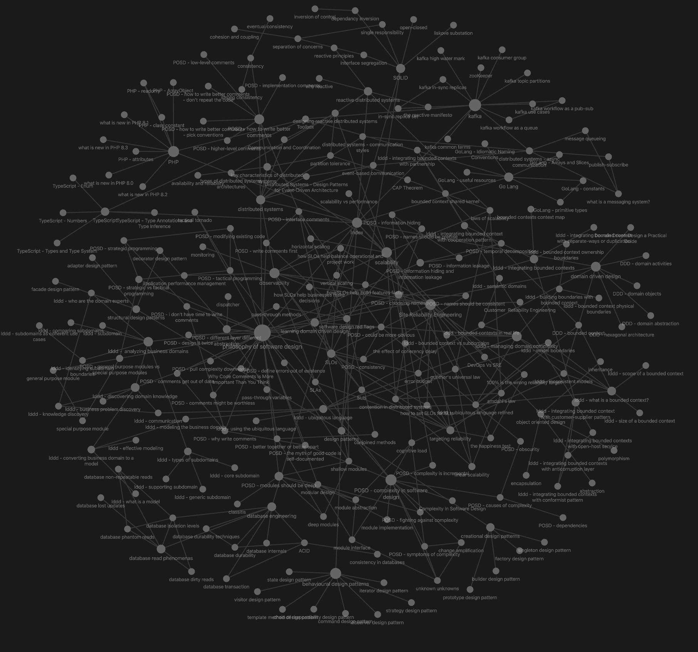

# Mustafa's Technical zettelkästen (notes)

This is my technical [logseq](https://logseq.com/) graph feel free to copy, edit or fork.

For better reading you can view it on [zettelkasten.mhussain.net](https://zettelkasten.mhussain.net) or import this graph into your  [logseq](https://logseq.com/) or at least use [vscode](https://code.visualstudio.com/) to view the .md files

This is how my baby graph looks right now:

